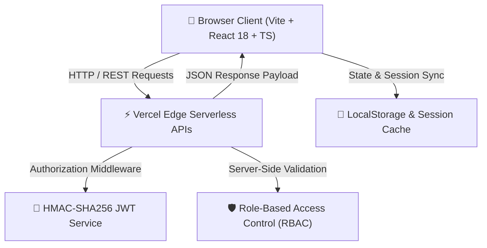

<div align="center">

# 🏛️ EduPortal — Academic Management Platform

[](https://university-management-system-one.vercel.app)
[](https://react.dev)
[](https://www.typescriptlang.org)
[](https://vitejs.dev)
[](https://tailwindcss.com)
[](LICENSE)

*A full-stack, enterprise-grade **University Management System** built with **Vite 5**, **React 18**, **TypeScript**, and **Vercel Serverless Functions** featuring **HMAC-SHA256 JWT Authentication** and **Role-Based Access Control (RBAC)**.*

[🔗 **Explore Live Production Application**](https://university-management-system-one.vercel.app)

---

</div>

## 📌 Table of Contents
- [✨ Key Features](#-key-features)
- [🏗️ System Architecture](#%EF%B8%8F-system-architecture)
- [🔑 Roles & Access Control Matrix](#-roles--access-control-matrix)
- [🔌 API Endpoints Reference](#-api-endpoints-reference)
- [🚀 Quick Start Guide](#-quick-start-guide)
- [📄 License](#-license)

---

## ✨ Key Features

### 🔐 1. Authentication & Role-Based Access Control (RBAC)
- **Multi-Role Portal Access:** Student, Faculty/Professor, and Administrator login modes.
- **Google Workspace SSO:** Google OAuth 2.0 Identity Services Integration.
- **Serverless HMAC-SHA256 JWT:** Signed authorization tokens validated on restricted API endpoints.
- **Input Security:** Strict validation rules preventing invalid account creation or access escalation.

### 📊 2. Student Records & Academic Dashboards
- Real-time GPA tracking, attendance summaries, and course enrollment counters.
- Dynamic time-of-day greeting badges (`Good morning`, `Good afternoon`, `Good evening`, `Good night`).
- Responsive mobile drawer sidebar for all viewports.

### 📚 3. Course Catalog & Self-Service Registration
- University curriculum catalog filtered by department and credit hours.
- Interactive course search and self-service registration toggle.
- Faculty modal for creating new course offerings (`+ Add New Course`).

### 📅 4. Attendance Registry & Transcripts
- Attendance registry with status indicators (`Present` / `Absent`).
- Examination score tables, letter grades (`A+`, `A`, `B`, `C`), and CGPA calculators.

### 📢 5. University Bulletins & Reports
- Categorized circular announcements feed (`Academic`, `Examination`, `Research`, `Campus Event`).
- One-click official PDF transcript export handler (`window.print()`).

---

## 🏗️ System Architecture



---

## 🔑 Roles & Access Control Matrix

| Feature / Action | 🎓 Student | 👨‍🏫 Professor | 🏛️ Admin |
| :--- | :---: | :---: | :---: |
| **View Dashboard & Transcripts** | ✅ | ✅ | ✅ |
| **Register & Drop Courses** | ✅ | ❌ | ✅ |
| **Create New Course Offering** | ❌ | ✅ | ✅ |
| **Record Attendance Logs** | ❌ | ✅ | ✅ |
| **Publish Announcement Bulletins** | ❌ | ✅ | ✅ |
| **System Analytics Reports** | ❌ | ✅ | ✅ |

---

## 🔌 API Endpoints Reference

| Endpoint | Method | Role Required | Description |
| :--- | :---: | :---: | :--- |
| `/api/auth/login` | `POST` | Public | Authenticates credentials and returns signed JWT token |
| `/api/auth/register` | `POST` | Public | Registers new student or faculty account |
| `/api/courses` | `GET` | Public | Returns complete university course catalog |
| `/api/courses` | `POST` | Professor / Admin | Creates new course offering (RBAC enforced) |
| `/api/attendance` | `GET` | Authenticated | Fetches attendance logs |
| `/api/attendance` | `POST` | Professor / Admin | Records student attendance entry (RBAC enforced) |
| `/api/notices` | `GET` | Public | Fetches university bulletin notices |
| `/api/notices` | `POST` | Professor / Admin | Publishes official university announcement (RBAC enforced) |

---

## 🚀 Quick Start Guide

### Prerequisites
- **Node.js**: v18.0.0 or higher
- **npm**: v9.0.0 or higher

### 1. Installation

```bash
# Clone repository
git clone https://github.com/sharadgholse4/university-management-system.git

# Navigate to project directory
cd university-management-system

# Install dependencies
npm install
```

### 2. Launch Development Server

```bash
npm run dev
```

The Vite dev server will start at `http://localhost:3000`.

### 3. Production Build

```bash
npm run build
```

Compiles TypeScript and packages optimized bundle into `dist/`.

---

## 📄 License
Distributed under the **MIT License**. See [`LICENSE`](LICENSE) for more information.
